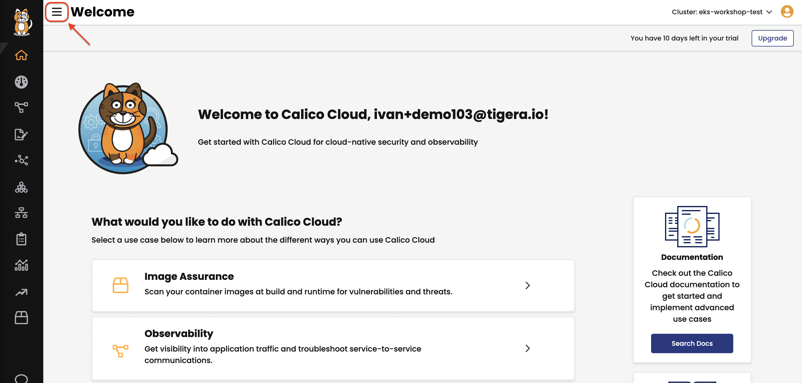

# Module 3: Joining EKS cluster to Calico Cloud

**Goal:** Join EKS cluster to Calico Cloud management plane.

>In order to complete this module, you must have [Calico Cloud trial account](https://www.tigera.io/tigera-products/calico-cloud/).

## Steps

1. Calico Cloud Registration

    After verifying email activation, a browser tab of the Calico Cloud UI is launched which will ask for a few personal details. After this step the Welcome screen shows four use cases which will give a quick tour for learning more. Pick a use case to continue. Tip: the menu icons on the left can be expanded to display the worded menu as shown:

    

2. Join EKS cluster to Calico Cloud management plane.

    Click the "Managed Cluster" in your left side of browser, enter the name of your cluster, select the Amazon EKS and click "Next"

    

    A custom token is generated along with the Calico Cloud Installer Operator manifest. The command will look similar to:

    ```bash
    kubectl apply -f https://installer.calicocloud.io/manifests/cc-operator/latest/deploy.yaml && curl -H "Authorization: Bearer xxxxxxxxxxxx" "https://www.calicocloud.io/api/managed-cluster/deploy.yaml" | kubectl apply -f -
    ```

    Copy the output to clipboard and paste into your terminal to run. Output should look similar to:

    ```text
    namespace/calico-cloud created
    customresourcedefinition.apiextensions.k8s.io/installers.operator.calicocloud.io created
    serviceaccount/calico-cloud-controller-manager created
    role.rbac.authorization.k8s.io/calico-cloud-leader-election-role created
    clusterrole.rbac.authorization.k8s.io/calico-cloud-metrics-reader created
    clusterrole.rbac.authorization.k8s.io/calico-cloud-proxy-role created
    rolebinding.rbac.authorization.k8s.io/calico-cloud-leader-election-rolebinding created
    clusterrolebinding.rbac.authorization.k8s.io/calico-cloud-installer-rbac created
    clusterrolebinding.rbac.authorization.k8s.io/calico-cloud-proxy-rolebinding created
    configmap/calico-cloud-manager-config created
    service/calico-cloud-controller-manager-metrics-service created
    deployment.apps/calico-cloud-controller-manager created
    % Total    % Received % Xferd  Average Speed   Time    Time     Time  Current
                                    Dload  Upload   Total   Spent    Left  Speed
    100   355  100   355    0     0    541      0 --:--:-- --:--:-- --:--:--   541
    secret/api-key created
    installer.operator.calicocloud.io/aks-westus created
    ```

    Joining the cluster to Calico Cloud can take a few minutes. Meanwhile the Calico resources can be monitored until they are all reporting `Available` as `True`.

    ```text
    Every 2.0s: kubectl get tigerastatus                                                                                                                    

    NAME                            AVAILABLE   PROGRESSING   DEGRADED   SINCE
    apiserver                       True        False         False      96s
    calico                          True        False         False      16s
    compliance                      True        False         False      21s
    intrusion-detection             True        False         False      41s
    log-collector                   True        False         False      21s
    management-cluster-connection   True        False         False      51s
    monitor                         True        False         False      2m1s
    ```

3. Configure log aggregation and flush intervals.

    ```bash
    kubectl patch felixconfiguration.p default -p '{"spec":{"flowLogsFlushInterval":"10s"}}'
    kubectl patch felixconfiguration.p default -p '{"spec":{"dnsLogsFlushInterval":"10s"}}'
    kubectl patch felixconfiguration.p default -p '{"spec":{"flowLogsFileAggregationKindForAllowed":1}}'
    ```

4. Enable TCP stats collection.

    >This feature allows collection of TCP socket stats leveraging eBPF TC programs. See the docs for [more details](https://docs.tigera.io/visibility/elastic/flow/tcpstats).

    ```bash
     kubectl patch felixconfiguration default -p '{"spec":{"flowLogsCollectTcpStats":true}}'
    ```

    In module 9 you can view these stats in the `Socket stats` tab on the right hand side when selecting a traffic flow edge.

[Next -> Module 4](../modules/configuring-demo-apps.md)
