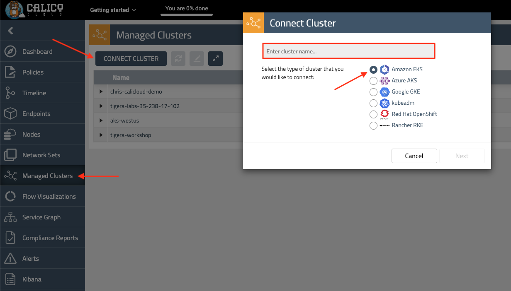

# Module 3: Joining EKS cluster to Calico Cloud

**Goal:** Join EKS cluster to Calico Cloud management plane.

>In order to complete this module, you must have [Calico Cloud trial account](https://www.tigera.io/tigera-products/calico-cloud/).

## Steps

1. Join EKS cluster to Calico Cloud management plane.

    Use your Calico Cloud account to login Calico Cloud management UI. Click the "Managed Cluster" in your left side of browser.
    <br>
    
    
    
    Click on "connect cluster"
    <br>
    
     

    Choose EKS and click next
    
    Run the installation script in your cluster.

    ```bash
    # script should look similar to this
    curl https://installer.calicocloud.io/xxxxxx_yyyyyyy-saay-management_install.sh | bash
    ```

    Joining the cluster to Calico Cloud can take a few minutes. Wait for the installation script to finish before you proceed to the next step.

    You should see the output similar to this:

    ```text
    [INFO] Checking for installed CNI Plugin
    [INFO] Deploying CRDs and Tigera Operator
    [INFO] Creating Tigera Pull Secret
    [INFO] Tigera Operator is Available
    [INFO] Adding Installation CR for Enterprise install
    [WAIT] Tigera calico is Progressing
    [INFO] Tigera Calico is Available
    [INFO] Deploying Tigera Prometheus Operator
    podmonitors.monitoring.coreos.com
    [INFO] Deploying CRs for Managed Cluster
    [INFO] Tigera Apiserver is Available
    [INFO] Generate New Cluster Registration Manifest
    [INFO] Creating connection
    [INFO] All Tigera Components are Available
    [INFO] Securing Install
    .....
    ```
    The final output should resemble:
    
    ```bash
    # output once your cluster join the calico cloud
    Install Successful

    Your Connected Cluster Name is arwb4wbh-management-managed-aksjesie2-aks-rg-jesie208-03cfb8-9713ae4f-hcp-eastus-azmk8s-io  
    ```
    Set the Calico Cluster Name as a variable to use later in this workshop. The Cluster Name can also be obtained from the Calico Cloud Web UI at a later date. For the example above `CALICOCLUSTERNAME` should be set to __arwb4wbh-management-managed-aksjesie2-aks-rg-jesie208-03cfb8-9713ae4f-hcp-eastus-azmk8s-io__
    
    ```bash
    export CALICOCLUSTERNAME=<Cluster Name>
    echo export CALICOCLUSTERNAME=$CALICOCLUSTERNAME >> ~/.bashrc
    ```
    
    In calico cloud management UI, you can see your own aks cluster added in "managed cluster", you can also confirm by
    ```bash
    kubectl get tigerastatus
    ```
    
    ```bash
    #make sure all customer resources are "AVAILABLE=True" 
    NAME                            AVAILABLE   PROGRESSING   DEGRADED   SINCE
    apiserver                       True        False         False      5m38s
    calico                          True        False         False      4m44s
    compliance                      True        False         False      4m34s
    intrusion-detection             True        False         False      4m49s
    log-collector                   True        False         False      4m19s
    management-cluster-connection   True        False         False      4m54s

2. Configure log aggregation and flush intervals.

    ```bash
    kubectl patch felixconfiguration.p default -p '{"spec":{"flowLogsFlushInterval":"10s"}}'
    kubectl patch felixconfiguration.p default -p '{"spec":{"dnsLogsFlushInterval":"10s"}}'
    kubectl patch felixconfiguration.p default -p '{"spec":{"flowLogsFileAggregationKindForAllowed":1}}'
    ```

4. Configure Felix to collect TCP stats - this uses eBPF TC program and requires miniumum Kernel version of v5.3.0. Further [documentation](https://docs.tigera.io/visibility/elastic/flow/tcpstats). 
    >[Felix](https://docs.tigera.io/reference/architecture/overview#felix) is one of the Calico components that is responsible for configuring routes, ACLs, and anything else required on the host to provide desired connectivity for the endpoints on that host.

    ```bash
    kubectl patch felixconfiguration default -p '{"spec":{"flowLogsCollectTcpStats":true}}'
    ```

[Next -> Module 4](../modules/configuring-demo-apps.md)
