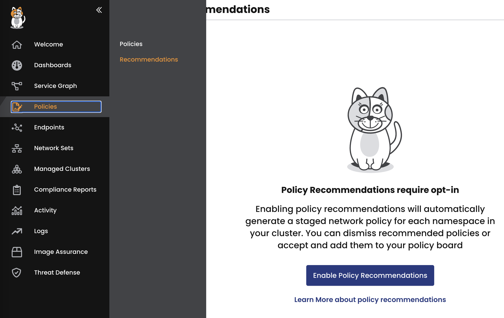
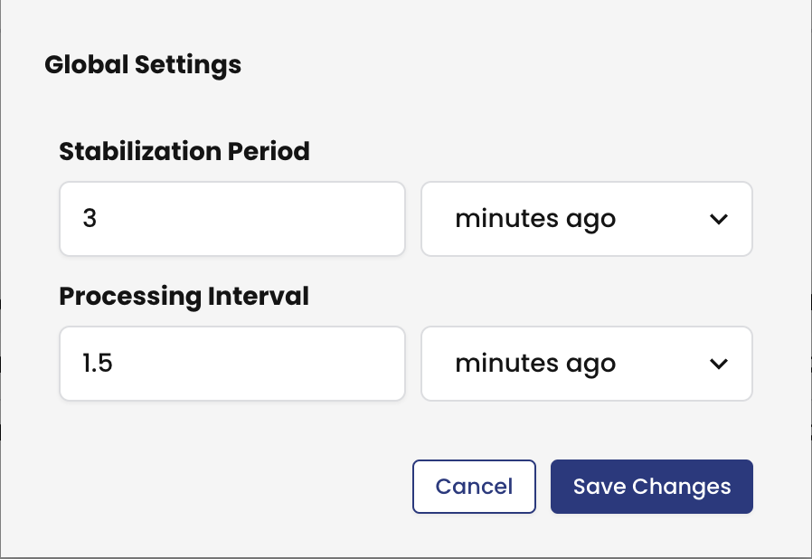

# Module 6: Namespace isolation

**Goal:** Leverage Policy Recommendation engine to auto-generate policies to protect applications at namespace level.

## Steps

1. Enable Policy Recommendation engine.

    Policy Recommendation engine aims to aid security and applications teams to quickly generate policies to secure applications and service running in the EKS cluster at the namespace level.

    a. Navigate to `Policies` -> `Recommendations` menu item in the left navigation panel and click `Enable Policy Recommendations` button to enable this feature.

    

    For the demo purpose it's useful to lower `Stabilization Period` and `Processing Interval` settings for the engine. You can access these settings by clicking on the `Global Settings` button in the top right corner of the `Policy Recommendations` view.

    

    b. Let the Policy Recommendation engine run for several minutes to propose policies.

    >It usually take about 5 minutes for the engine to start generating recommended policies.

2. Review the proposed policies and move them to the `Policy Board`.

    The proposed policies land in the `namespace-isolation` tier as the staged policies. One can let them run in the staged mode for some time if needed or enforce them immediately.

3. Enforce policies and test connectivity between the pods.

    Install `curl` utility into the `loadgenerator` pod to use it for testing.

    ```bash
    kubectl exec -it $(kubectl get po -l app=loadgenerator -ojsonpath='{.items[0].metadata.name}') -c main -- sh -c 'apt-get update && apt-get install -y curl iputils-ping netcat && curl --help'
    ```

    Create a testing pod in `dev` namespace.

    ```bash
    kubectl -n dev run --restart=OnFailure --image nicolaka/netshoot netshoot -- sh -c 'while true; do sleep 30; done'
    ```

    Enforce staged policies that were added to the `namespace-isolation` tier and test the connectivity between the pods.

    ```bash
    # test connectivity from dev/netshoot to paymentservice.default service over port 50051
    kubectl -n dev exec -it netshoot -- sh -c 'nc -zv -w2 paymentservice.default 50051'

    # test connectivity from dev/centos to frontend.default service
    kubectl -n dev exec -it centos -- sh -c 'curl -m2 -sI frontend.default 2>/dev/null | grep -i http'

    # test connectivity from loadgenerator to frontent service within the default namespace
    kubectl exec -it $(kubectl get po -l app=loadgenerator -ojsonpath='{.items[0].metadata.name}') -c main -- sh -c 'curl -m2 -sI frontend 2>/dev/null | grep -i http'

    # test connectivity from default namespace to the Internet
    kubectl exec -it $(kubectl get po -l app=loadgenerator -ojsonpath='{.items[0].metadata.name}') -c main -- sh -c 'curl -m2 -sI www.google.com 2>/dev/null | grep -i http'
    ```

    Only the connections allowed by the recommended policies should succeed.

[Next -> Module 7](../modules/using-security-controls.md)
