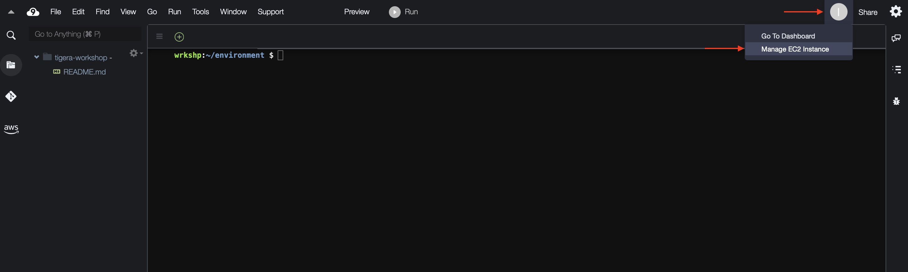
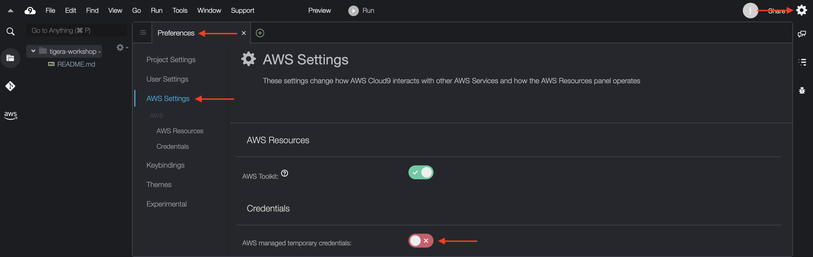

# Module 1: Setting up work environment

**Goal:** Set up and configure your environment to work with AWS resources.

## Choose between local environment and Cloud9 instance

The simplest ways to configure your working environment is to either use your local environment, i.e. laptop, desktop computer, etc., or create an [AWS Cloud9 environment](https://docs.aws.amazon.com/cloud9/latest/user-guide/tutorial.html) from which you can run all necessary commands in this workshop. If you're familiar with tools like `SSH client`, `git`, `jq`, `netcat` and feel comfortable using your local shell, then go to `setp 2` in the next section.

## Steps

1. Create Cloud9 workspace environment.

    To configure a Cloud9 instance, open AWS Console and navigate to `Services` > `Cloud9`. Create environment in the desired region. You can use all the default settings when creating the environment, but consider using `t3.small` instance as the `t2.micro` instance could be a bit slow. You can name it as `tigera-workspace` to quickly find it in case you have many `Cloud9` instances. It usually takes only a few minutes to get the Cloud9 instance running.

2. Ensure your environment has these tools:

    - [AWS CLI](https://docs.aws.amazon.com/cli/latest/userguide/cli-chap-install.html)
    - [Git](https://git-scm.com/book/en/v2/Getting-Started-Installing-Git)
    - [eksctl](https://docs.aws.amazon.com/eks/latest/userguide/eksctl.html)
    - [EKS kubectl](https://docs.aws.amazon.com/eks/latest/userguide/install-kubectl.html)
    - `jq` and `netcat` utilities

    Check whether these tools already present in your environment. If not, install the missing ones.

    ```bash
    # run these commands to check whether the tools are installed in your environment
    aws --version
    git --version
    eksctl version
    kubectl version --short --client

    # install jq and netcat
    sudo yum install jq nc -y
    jq --version
    nc --version
    ```
    
    >If `aws` version is `1.x`, upgrade it to version `2.x`.
    ```bash
    curl "https://awscli.amazonaws.com/awscli-exe-linux-x86_64.zip" -o "awscliv2.zip"
    unzip awscliv2.zip
    sudo ./aws/install
    # reload bash shell
    . ~/.bashrc
    aws --version
    ```

    >For convenience consider configuring [autocompletion for kubectl](https://kubernetes.io/docs/tasks/tools/included/optional-kubectl-configs-bash-linux/#enable-kubectl-autocompletion).

3. Download this repo into your environment:

    ```bash
    git clone https://github.com/chrisman-io/tigera-eks-workshop.git  
    ```

4. Configure AMI role for Cloud9 workspace.

    >This is necessary when using Cloud9 environment which has an IAM role automatically associated with it. You need to replace this role with a custom IAM role that provides necessary permissions to build EKS cluster so that you can work with the cluster using `kubectl` CLI.

    a. When using Cloud9 instance, by default the instance has AWS managed temporary credentials that provide limited permissions to AWS resources. In order to manage IAM resources from the Cloud9 workspace, export your user's [AWS Access Key/ID](https://docs.aws.amazon.com/IAM/latest/UserGuide/id_credentials_access-keys.html) via environment variables. If you already have them under your `~/.aws/credentials` then you can skip this step.

    >It is recommended to use your personal AWS account which would have full access to AWS resources. If using a corporate AWS account, make sure to check with account administrators to provide you with sufficient permissions to create and manage EKS clusters and Load Balancer resources.

    ```bash
    export AWS_ACCESS_KEY_ID="<your_accesskey_id>"
    export AWS_SECRET_ACCESS_KEY="<your_secretkey>"
    ```

    b. Create IAM role.

    ```bash
    # go to cloned repo
    cd ./tigera-eks-workshop

    IAM_ROLE='tigera-workshop-admin'
    # assign AdministratorAccess default policy. You can use a custom policy if required.
    ADMIN_POLICY_ARN=$(aws iam list-policies --query 'Policies[?PolicyName==`AdministratorAccess`].Arn' --output text)
    # create IAM role
    aws iam create-role --role-name $IAM_ROLE --assume-role-policy-document file://configs/trust-policy.json
    aws iam attach-role-policy --role-name $IAM_ROLE --policy-arn $ADMIN_POLICY_ARN
    # tag role
    aws iam tag-role --role-name $IAM_ROLE --tags '{"Key": "purpose", "Value": "tigera-eks-workshop"}'
    # create instance profile
    aws iam create-instance-profile --instance-profile-name $IAM_ROLE
    # add IAM role to instance profile
    aws iam add-role-to-instance-profile --role-name $IAM_ROLE --instance-profile-name $IAM_ROLE
    ```

    c. Assign the IAM role to Cloud9 workspace.

    - Click the grey circle button (in top right corner) and select `Manage EC2 Instance`.

        

    - Select the instance, then choose `Actions` > `Security` > `Modify IAM Role` and assign the IAM role you created in previous step, i.e. `tigera-workshop-admin`.

        

    d. Update IAM settings for your workspace.

    - Return to your Cloud9 workspace and click the gear icon (in top right corner)
    - Select AWS SETTINGS
    - Turn off AWS managed temporary credentials
    - Close the Preferences tab

        

    - Remove locally stored `~/.aws/credentials`

        ```bash
        rm -vf ~/.aws/credentials
        ```

    e. Unset `AWS_ACCESS_KEY_ID` and `AWS_SECRET_ACCESS_KEY` to allow Cloud9 instance to use the configured IAM role.

    ```bash
    unset AWS_ACCESS_KEY_ID AWS_SECRET_ACCESS_KEY
    ```

[Next -> Module 2](../modules/creating-eks-cluster.md)
