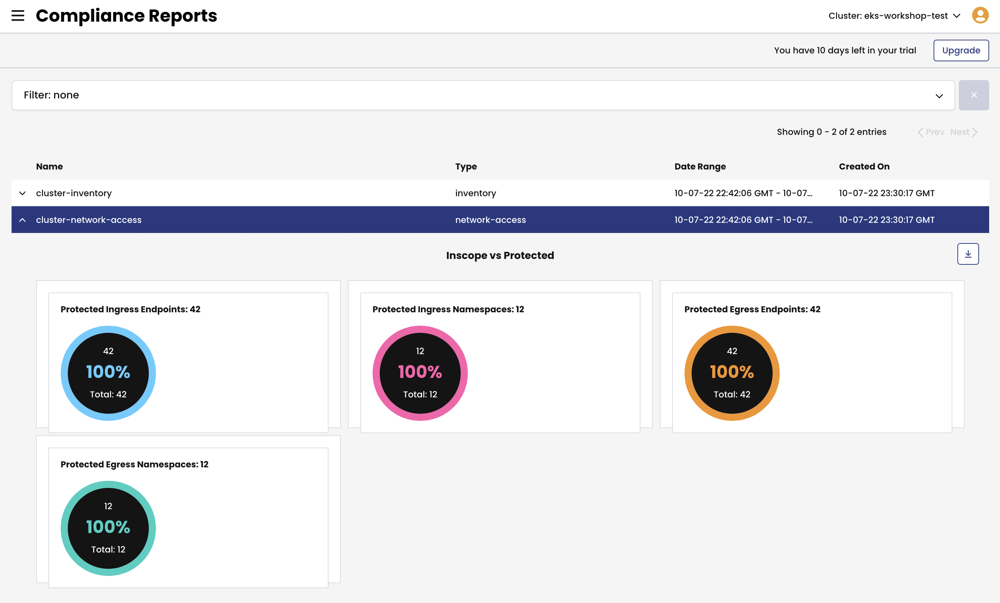

# Module 9: Using compliance reports

**Goal:** Use global reports to satisfy compliance requirements.

## Steps

1. Use `Compliance Reports` view to see all generated reports.

    >We have deployed a few compliance reports in one of the first labs and by this time a few reports should have been already generated. If you don't see any reports, you can manually kick off report generation task. Follow the steps below if you need to do so.

    Calico provides `GlobalReport` resource to offer [Compliance reports](https://docs.tigera.io/compliance/compliance-reports/) capability. There are several types of reports that you can configure:

    - CIS benchmarks
    - Inventory
    - Network access
    - Policy audit

    >When using EKS cluster, you need to [enable and configure audit log collection](https://docs.tigera.io/compliance/compliance-reports/compliance-managed-cloud#enable-audit-logs-in-eks) on AWS side in order to get the data captured for the `policy-audit` reports.

    A compliance report could be configured to include only specific endpoints leveraging endpoint labels and selectors. Each report has the `schedule` field that determines how often the report is going to be generated and sets the timeframe for the data to be included into the report.

    Compliance reports organize data in a CSV format which can be downloaded and moved to a long term data storage to meet compliance requirements.

    

2. *[Optional]* Manually kick off report generation task.

    >In order to generate a compliance report, Calico needs at least 1 hour worth of data for `inventory`, `network-access` reports, and at least 24 hours worth of data for `cis` reports. If commands below don't result in any reports being generated, give it some time and then retry the report generation.

    It is possible to kick off report generation via a one off job.

    ```bash
    # get Calico version
    CALICO_VERSION=$(kubectl get clusterinformation default -ojsonpath='{.spec.cnxVersion}')
    # set report names
    CIS_REPORT_NAME='daily-cis-results'
    INVENTORY_REPORT_NAME='cluster-inventory'
    NETWORK_ACCESS_REPORT_NAME='cluster-network-access'
    
    # enable if you configured audit logs for EKS cluster and uncommented policy audit reporter job
    # you also need to add variable replacement in the sed command below
    # POLICY_AUDIT_REPORT_NAME='cluster-policy-audit'

    # get compliance reporter token
    COMPLIANCE_REPORTER_TOKEN=$(kubectl get secrets -n tigera-compliance | grep 'tigera-compliance-reporter-token*' | awk '{print $1;}')

    # replace variables in YAML and deploy reporter jobs
    sed -e "s?<COMPLIANCE_REPORTER_TOKEN>?$COMPLIANCE_REPORTER_TOKEN?g" \
      -e "s?<CALICO_VERSION>?$CALICO_VERSION?g" \
      -e "s?<CIS_REPORT_NAME>?$CIS_REPORT_NAME?g" \
      -e "s?<INVENTORY_REPORT_NAME>?$INVENTORY_REPORT_NAME?g" \
      -e "s?<NETWORK_ACCESS_REPORT_NAME>?$NETWORK_ACCESS_REPORT_NAME?g" \
      -e "s?<REPORT_START_TIME_UTC>?$(date -u -d '1 hour ago' '+%Y-%m-%dT%H:%M:%SZ')?g" \
      -e "s?<REPORT_END_TIME_UTC>?$(date -u +'%Y-%m-%dT%H:%M:%SZ')?g" \
      demo/40-compliance-reports/cluster-reporter-jobs.yaml | kubectl apply -f -
    ```

[Next -> Module 10](../modules/using-alerts.md)
